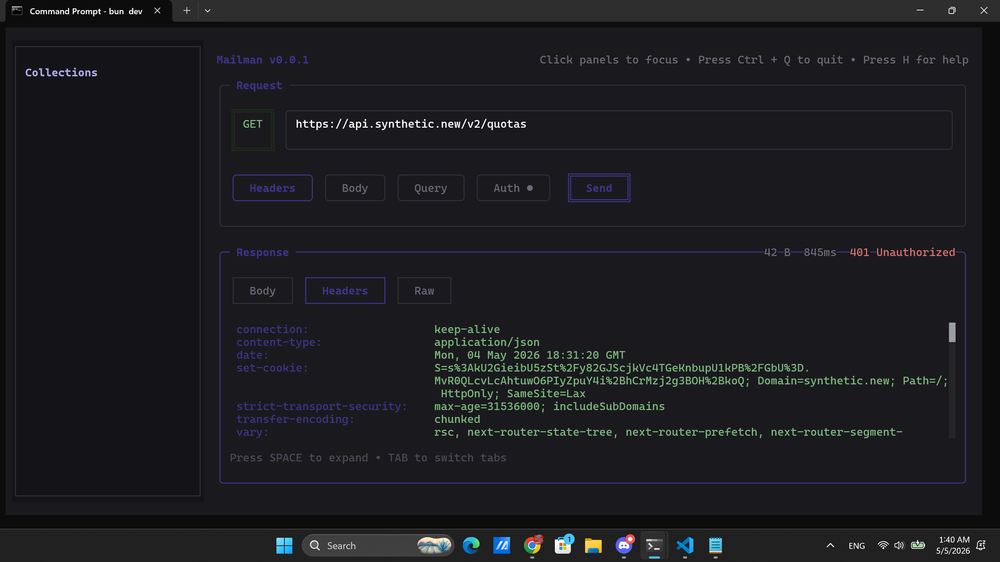

<h1 align="center">Mailman</h1>

<div align="center">

[](LICENSE)
[](https://github.com/anhtri04/mailman)
[](https://www.typescriptlang.org/)
[](https://bun.sh)

</div>

A terminal-based HTTP client built with [Bun](https://bun.sh) and [OpenTUI](https://opentui.org).



## Features

- **Interactive TUI** — Full terminal user interface with mouse and keyboard support
- **HTTP Methods** — GET, POST, PUT, DELETE, PATCH
- **Request Configuration**
  - Headers editor with common presets
  - Request body editor with content type selection
  - Query parameter builder with live URL preview
  - Authentication: Bearer token and API key (header or query)
- **Response Viewer** — Syntax-highlighted JSON, XML, HTML with raw view
- **Collections** — Organize requests into collections with full CRUD support
- **Theme System** — 37 built-in themes with live preview (Ctrl+T)
- **Keyboard Shortcuts** — Efficient navigation without leaving the keyboard
- **Persistent Storage** — Collections and preferences saved to `~/.mailman/`

## Quick Start

```bash
# Install dependencies
bun install

# Run the application
bun dev
```

## Usage

### CLI Mode (MVP)

Run the integrated CLI variant:

```bash
bun run dev:cli
```

CLI source: [`src/modes/cli`](src/modes/cli)

### Navigation

| Key | Action |
|-----|--------|
| `Tab` | Switch response view (Body / Headers / Raw) |
| `Space` | Expand response to full-screen modal |
| `Escape` | Close modal / go back |
| `Ctrl+Q` | Quit application |
| `Ctrl+T` | Open theme selector |
| `Ctrl+G` | Open Catalog panel |
| `Ctrl+S` | Save current request to its collection |

### Request Panel

1. **Method** — Click the method badge to cycle through HTTP methods
2. **URL** — Type the request URL
3. **Tabs** — Click to open editors:
   - **Headers** — Add/edit request headers with preset suggestions
   - **Body** — Edit request body (shown for POST/PUT/PATCH)
   - **Query** — Build query parameters with live URL preview
   - **Auth** — Configure authentication (None, Bearer Token, or API Key)

Each tab shows a `●` indicator when it contains data.

### Authentication

| Mode | Behavior |
|------|----------|
| **No Auth** | Send requests without authentication |
| **Bearer Token** | Adds `Authorization: Bearer <token>` header |
| **API Key (Header)** | Adds a custom header (e.g. `X-API-Key: <value>`) |
| **API Key (Query)** | Appends to URL (e.g. `?api_key=<value>`) |

### Collections

- Click the **Import** button to create a new collection
- Click a collection to select it, then click **Add** to create a request
- Click a request to load it into the request panel
- Click **Delete** to remove a collection or request
- Press `Ctrl+S` to save changes to a loaded request

### Response Panel

- **Status Code** — Color-coded (green = 2xx, yellow = 3xx, orange = 4xx, red = 5xx)
- **Response Time** — Displayed in milliseconds
- **Content Size** — Human-readable size (B, KB, MB)
- **Tabs** — Body (syntax-highlighted), Headers, Raw

## Development

```bash
bun install          # Install dependencies
bun dev              # Run the application
bun test             # Run all tests
bun test --watch     # Run tests in watch mode
bun test src/services/http-client.test.ts   # Run a single test file
bun test -t "should make GET request"       # Run tests by name pattern
bun run fmt          # Format code with oxfmt
bun run fmt:check    # Check formatting without modifying
bun run lint         # Lint with oxlint (includes type checking)
bun run lint:fix     # Auto-fix linting issues
bun run seed         # Load example collections into ~/.mailman/
```

## Architecture

| Layer | Technology |
|-------|-----------|
| Runtime | [Bun](https://bun.sh) |
| UI Framework | [OpenTUI](https://opentui.org) React reconciler |
| Language | TypeScript (strict mode) |
| Testing | Bun test runner |
| Formatting | oxfmt |
| Linting | oxlint |

## Project Structure

```
index.tsx                 # Entry point
src/
  modes/
    tui/                  # TUI mode (interactive app)
      App.tsx             # TUI root component
      components/         # TUI UI components + tests
      hooks/              # TUI-specific hooks + tests
    cli/                  # CLI mode implementation
  types.ts                # Shared type definitions
  services/               # Business logic & IO (camelCase.ts)
  theme/                  # Theme system — colors, types, ThemeProvider
  utils/                  # Pure utility functions (camelCase.ts)
```

## License

[MIT](LICENSE)
